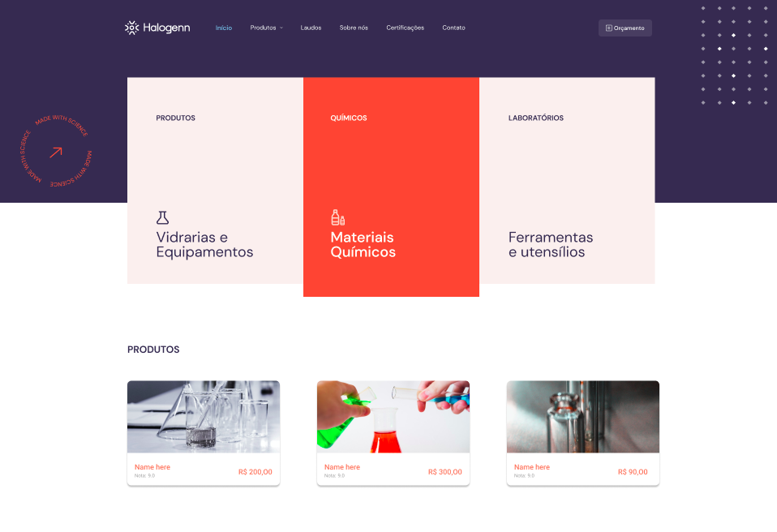

# Linklab.challenge


<p align="center">
  
</p>

## 💻 Projeto

Implementação de um desafio de uma aplicação responsiva com consumo de API Restful de listagem de produtos.

## 🔨 Features
- [x] Consumo de API Restful
- [x] Responsividade
- [ ] Menu dropdown


## 🚀 Tecnologias

Esse projeto foi desenvolvido com as seguintes tecnologias:

- [Docker](https://www.docker.com/)
- [Mongodb](https://www.mongodb.com/)
- [Mongoose](https://mongoosejs.coma/)
- [Nodejs](https://nodejs.org/)
- [Nextjs](https://nextjs.org/)
- [Reactjs](https://reactjs.org/)
- [Sass](https://sass-lang.com/)
- [Typescript](https://www.typescriptlang.org/)
- [Yarn](https://yarnpkg.com/)

### Como executar?

> obs: Necessário possuir <a href="https://nodejs.org/" target="_blank">Nodejs</a>, <a href="https://www.docker.com/" target="_blank">Docker</a>  e <a href="https://docs.docker.com/compose/" target="_blank">Docker Compose</a> em sua máquina.

Usuários Ubuntu/Linux podem configurar o Docker e o Docker Compose através do <a href="https://docs.docker.com/engine/install/">Docker Engine</a> com as seguintes instruções.
```
$ curl -fsSL https://get.docker.com -o get-docker.sh
$ sudo sh get-docker.sh
$ sudo groupadd docker
$ sudo usermod -aG docker $USER 
$ sudo reboot // para reiniciar sua máquina

```
Para outras distros, Mac ou Windows <a href="https://docs.docker.com/engine/install/" target="_blank">clique aqui para ver mais</a>.

Após instalar o Docker e o Docker compose ou o Docker engine, prossiga com os seguintes passos, abaixo.


1. Instalar as dependências do projeto com `yarn install` ou npm `install`
2. Criar um arquivo `.env` na raiz do projeto
3. Copiar conteúdo de `.env.example` e colar no `.env` 
4. Subir o banco em um container docker com `docker compose up -d` ou `docker-compose up -d`;
5. Popular a base com os produtos com `yarn seed` ou `npm run seed`
6. Iniciar o projeto com `yarn dev` ou `npm run dev`

### :memo: Licença

Esse projeto está sob a [licença MIT](./LICENSE).

-----

Feito com 💜 por [@jhollyferr](https://www.instagram.com/jhollyferr/) :wave:

